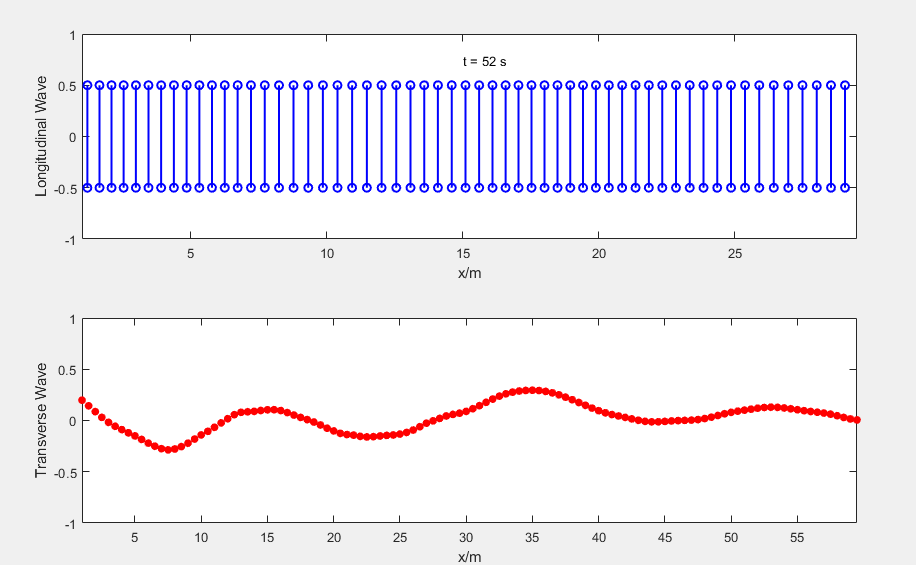

# Elastic Wave

## Description

The Elastic Wave Propagation is a `MATLAB` script simulates the propagation of both **longitudinal** and **transverse** *elastic waves* through a one-dimensional medium composed of multiple bodies (oscillators). The project uses the finite difference method to solve the wave equation and visualizes the displacement of the medium over time for both types of waves with dynamic plots.

<p align="center">
    <a href="https://github.com/justin-marian/elastic-wave/tree/main/demo/simulation.mp4">
        
    </a>
</p>

## Physical Parameters

- **`P` (Bodies):** Controls the number of bodies, influencing simulation detail.
- **`m` (Masses):** Specifies individual body masses, enabling heterogeneous simulations.
- **`k` (Stiffness):** Sets medium stiffness, impacting wave behavior.
- **`N` (Discrete Time):** Determines temporal resolution for stability and accuracy.
- **Wave Parameters:** Specify **amplitude**, **frequency**, and **forces** for accurate wave control and customization. Adjust parameters according to specific simulation requirements.

## Simulation Seetings

- **Spring Constants:** Spring constants represent the stiffness of the medium and are assigned to each oscillator.
- **Discrete Time:** Time is discretized to ensure numerical stability and accuracy in the simulation.
- **Initial Displacement:** Initial displacement values for both longitudinal and transverse waves are set to zero.
- **Wave Parameters:** Parameters such as amplitude and angular frequency which define wave propagation.

## Boundry Conditions

- **left boundary** condition is implemented to maintain the wave's behavior at the beginning of the medium. It regulates how the **longitudinal/transverse** wave interacts with the first oscillator.
- **right boundary** condition fixes the displacement of the last oscillator, simulating a rigid boundary where no displacement is allowed.

## Wave Equations

| Equation | Description                                                                                        |
|----------|----------------------------------------------------------------------------------------------------|
| **$$\frac{\partial^2 \eta_L}{\partial t^2} = \frac{k}{m} \frac{\partial^2 \eta_L}{\partial x^2}$$** | Describes `longitudinal` wave propagation, where the displacement **$\eta_L$** of the medium changes over time and space. It reveals how the acceleration of the medium at any point is influenced by its stiffness (**$k$**) and inertia (**$m$**). |
| **$$\frac{\partial^2 \eta_T}{\partial t^2} = \frac{k}{m} \frac{\partial^2 \eta_T}{\partial x^2}$$** | Illustrates `transverse` wave propagation, depicting how the displacement **$\eta_T$** evolves over time and space. It explains how the acceleration of the medium is determined by its stiffness (**$k$**) and mass (**$m$**), influencing the wave behavior. |

## Usage

- **Define Physical Parameters:**
  - Number of bodies (**P**) in the medium.
  - An array of masses (**m**) for the bodies, ensuring each body has a corresponding mass value.
- **Run the Script:**
  - Execute the script `elastic_wave(P, m)`, in **MATLAB**.

**Example:**

```matlab
P = 120;                % Number of bodies (oscillators)
m = ones(1, P);         % Array of masses for the bodies
m(P/2 : P) = 0.25;      % Set different masses for the bodies
elastic_wave(P, m);     % Run the script
```

**Explanation:**

This example initializes the simulation with **120 oscillators**, each having a mass of **1 kg**. The masses of the oscillators in the second half of the medium are then set to **0.25 kg**.
Finally, the `elastic_wave` function is called to execute the simulation. Adjust the parameters according to your specific simulation requirements.
